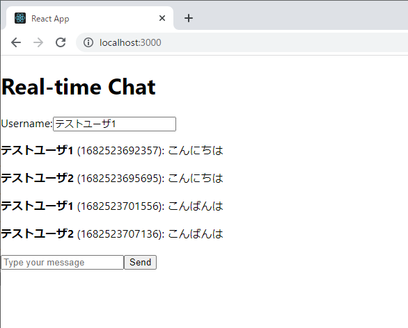
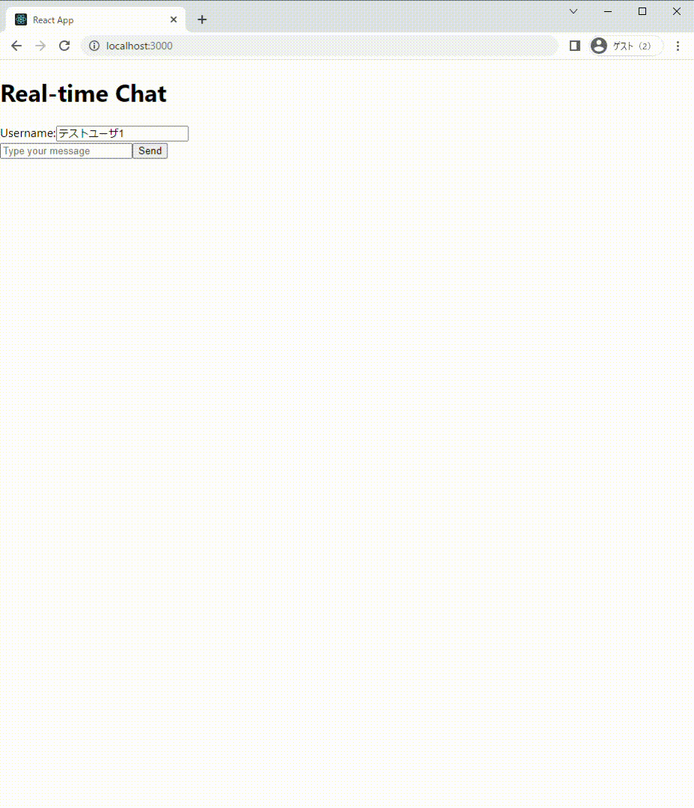

# Real-time Chat

Webソケット通信を利用したリアルタイムチャットアプリです。



## 環境構築方法

### 1. 使用技術
- フロントエンド：React
- バックエンド：Express
- データベース：DynamoDB

### 2. フォルダ構成
```
.
├── chat-backend
├── chat-app
├── README.md
├── docker-compose.yml
├── real-time-chat.gif
└── real-time-chat.png
```

- `hicb-backend`: バックエンドソースコードを格納。
- `hicb-frontend`: フロントエンドソースコードを格納。
- `README.md`: プロジェクト説明ファイル。
- `docker-compose.yml`: Docker Compose起動時に使用するファイル。
- `real-time-chat.png`: 実行例Gif画像。
- `real-time-chat.png`: サンプル画像。

### 3. 事前準備
- Docker Composeを実行できる環境
  - [UbuntuにDockerをインストールする手順](https://qiita.com/ryome/items/4b6b934b1b2021acfa26)
  - [UbuntuにDocker-composeをインストールする手順](https://qiita.com/ryome/items/56a3263f347a08bd860f)

### 4. ローカル環境構築手順
1. GitHubから資材取得する

- コマンド
```
git clone https://github.com/ryomeblog/real-chat.git
cd real-chat
```

- 実行例
```
```

2. Docker Composeで起動させる

- コマンド
```
docker-compose up -d --build
docker-compose ps
```

- 実行例
```
$ docker-compose up -d
Creating network "chatreal_default" with the default driver
Creating dynamodb-local ... done
Creating dynamodb-admin ... done
Creating backend-app    ... done
Creating frontend-app   ... done
$ docker-compose ps
     Name                   Command               State                          Ports
-------------------------------------------------------------------------------------------------------------
backend-app      docker-entrypoint.sh npm start   Up      0.0.0.0:13001->13001/tcp,:::13001->13001/tcp
dynamodb-admin   docker-entrypoint.sh node  ...   Up      0.0.0.0:8001->8001/tcp,:::8001->8001/tcp
dynamodb-local   java -jar DynamoDBLocal.ja ...   Up      0.0.0.0:8000->8000/tcp,:::8000->8000/tcp
frontend-app     docker-entrypoint.sh npm start   Up      13000/tcp, 0.0.0.0:3000->3000/tcp,:::3000->3000/tcp
```

1. Docker Composeで停止させる

- コマンド
```
docker-compose down
```

- 実行例
```
$ docker-compose down
Stopping frontend-app   ... done
Stopping dynamodb-admin ... done
Stopping backend-app    ... done
Stopping dynamodb-local ... done
Removing frontend-app   ... done
Removing dynamodb-admin ... done
Removing backend-app    ... done
Removing dynamodb-local ... done
Removing network chatreal_default
```

## 実行例

- [localhost:3000](http://localhost:3000/)にアクセスする


